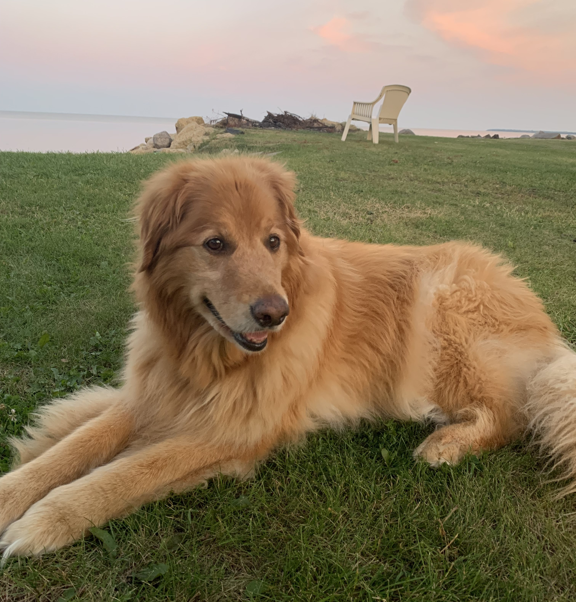

# Introduction

 
I grew up in Winnipeg, MB, Canada (born 3 September 2002) and attended St. Paul's High School. Here, I developed my passion for science and my overall motivation to succeed academically. I was then lucky enough to receive a [scholarship](https://registrar.uwo.ca/student_finances/scholarships_awards/admission/national_scholarship_program.html) to study at [Western University](https://www.uwo.ca/index.html) in London, ON. I chose the [Integrated Science](https://uwo.ca/sci/wisc/index.html) program because it allowed me to be exposed to all areas of science and how they interconnect with each other and with society at large. It also allowed me to simultaneously pursue a specialization in any scientific discipline, of which I chose physics due to its ability to fuel my curiosity as well as my mathematical inclinations. 

I later became fascinated by quantum mechanics, and in particular, quantum computing. The way that these counterintuitive quantum phenomena could be harnessed for a potentially revolutionary technology was incredibly intriguing to me. I began to immerse myself in the field, and was later introduced to the more general field of condensed matter physics, where quantum mechanics is applied to study materials and their properties. I spent two summers with Prof. [Jesko Sirker](http://drop.physics.umanitoba.ca/~jsirker/Dokuwiki/doku.php?id=home) at the [University of Manitoba](https://umanitoba.ca/) where we studied the phenomenon of many-body localization (or the lack thereof... see [here](/docs/research/highlights/MBL/index.md) for more information). In addition, I spent a year with Prof. [Mahi Singh](https://physics.uwo.ca/~msingh/) at Western where I was introduced to the field of plasmonics. This all led me to pursue a Master of Science degree at [McGill University](https://www.mcgill.ca/) in theoretical condensed matter physics with Prof. [Bill Coish](https://www.physics.mcgill.ca/~coish/), where I currently reside. I plan to pursue a PhD after the completion of my Master's, and hopefully become a research scientist in computational and theoretical quantum physics.

# Vita

2024-Present: MSc, McGill University

2020-2024: BSc, Western University

# Other Interests

*My beautiful dog, Gracie*

When not at the office, there's a good chance you'll find me at the track. I am a competitive track and field athlete in the long and triple jump and you can learn more about this [here](./track.md).

As an active music nerd, I enjoy playing all kinds of music on the piano and I am obsessed with keeping up with new album releases and typically making an album of the year ranking at the end of each year.

I am also a big NBA fan. As a Canadian, the Toronto Raptors have always been my number one, but the Oklahoma City Thunder have also become a recent favourite.

# CV

<!-- How to embed a PDF -->
<iframe width="100%" height="600" src="./media/CV_Nov_2024.pdf">