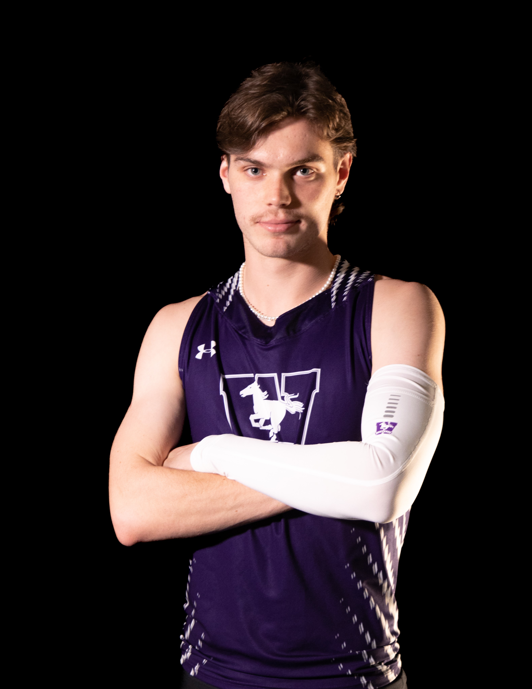

# Track and Field

I train and compete in track and field as a [long and triple jumper](https://worldathletics.org/athletes/canada/robert-gerstner-14914567). Currently I train with McGill's varsity team, but previously I was on Western's varsity team as well as Winnipeg Optimist Athletics. Despite the tremendous commitment of time and energy, typically spending 2 or more hours per day training throughout the entire year, the sport has become an incredible passion of mine, and I have high aspirations for myself. Additionally, the sport has brought me some of my fondest memories and closest friends, and it has taught me great lessons about dealing with adversity in the pursuit of a goal.

Unfortunately, each of my competition seasons have been plagued with injury since 2022. However, I hope to make a grand comeback in 2025. My current personal bests stand at 7.32m in the long jump (achieved in June 2024) and 14.92 in the triple jump (achieved in August 2022). For the latter, I received a bronze medal at the 2022 Canada Summer Games for Team Manitoba. In 2025, I plan to compete in the USports (Canadian University) National Championships, the Canadian Senior National Championships, and the 2025 Canada Summer Games. 

    
    
    

