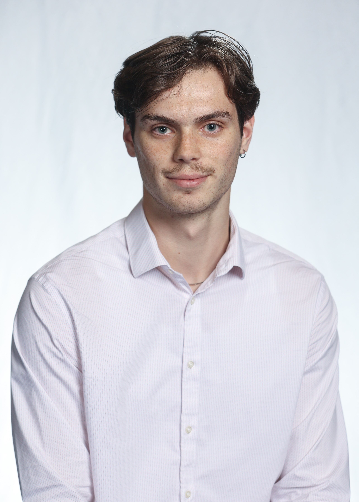

# Robert Gerstner

Welcome!

# About Me

 

I am a first-year Master's student in the Department of Physics at McGill University supervised by Prof. [Bill Coish](https://www.physics.mcgill.ca/~coish/). I am interested in harnessing AI for scientific discovery with a current focus in quantum many-body physics. I obtained my Bachelor's degree from Western University where I studied Integrated Science with a specialization in physics. I hope to pursue a PhD degree after the completion of my MSc.

I can be reached via email at [robert.gerstner@mail.mcgill.ca](mailto:robert.gerstner@mail.mcgill.ca), and my CV can be found [here](./home_media/CV_Apr_2025.pdf).

# Education

| Year           | Degree               | Institution         | Location              |
|----------------|----------------------|---------------------|-----------------------|
| 2024-Present   | Master of Science    | McGill University   | Montréal, QC, Canada  |
| 2020-2024      | Bachelor of Science  | Western University  | London, ON, Canada    |

# Activity

## Publications

- [February 10, 2025] A significantly updated version of our MBL manuscript is now on the [arXiv](https://arxiv.org/abs/2401.08031). We now believe we have strong analytical evidence for a lack of many-body localization in the disordered Heisenberg and mixed-field Ising models, and open a new avenue towards further studies of MBL via operator growth.

- [December 19, 2024] My mini research project studying arbitrary one-dimensional periodic materials with graph theory is available on the [arXiv](https://arxiv.org/abs/2412.15107).

- [January 16, 2024] My first paper, coming out of my work with Prof. Jesko Sirker in collaboration with Dr. Alex Weisse is now on the [arXiv](https://arxiv.org/abs/2401.08031)! We study localization in the Heisenberg model through the novel lens of operator growth, finding strong evidence for a lack of many-body localization.

## Conferences, Workshops, Talks, Posters

- [March 17, 2025] I gave a talk at the APS Global Physics Summit in Anaheim, California on my work in many-body localization (slides can be found [here](./home_media/APS_slides_2025.pdf)). I also attended the conference throughout the rest of the week, with a focus on talks on the intersection of artificial intelligence, quantum physics, and material science. Lots of interesting work being done!

- [November 12-14, 2024] I attended the Workshop on Quantum Simulation with Spin Qubits in Vancouver, British Columbia (at UBC) as a member of the theory pillar for the [Consortium on Quantum Simulation with Spin Qubits (CQS2Q)](https://www.nserc-crsng.gc.ca/ase-oro/Details-Detailles_eng.asp?id=751954).

- [October 15-16, 2024] I attended the [Fall INTRIQ Meeting](https://www.intriq.org/events/rencontre-automnale-2024-de-lintriq) in Bromont, Quebec to discuss progress in quantum research in Quebec.

- [September 15-20, 2024] I attended the [IEEE Quantum Week](https://qce.quantum.ieee.org/2024/) in Montreal, Quebec.

- [May 27, 2024] I gave a talk at the CAP Congress in London, Ontario on my work on harmonic generation in metallic nanohybrids (slides can be found [here]). My talk won [third prize](./home_media/CAP_certificate_2024.pdf) in the AMO division.

- [March 22, 2024] I presented a [poster](./home_media/undergrad_thesis_poster.pdf) on my work on my undergraduate thesis work at Western University.

- [December 6, 2023] I organized and gave an information session to students of Western's Integrated Science program on how to get involved with undergraduate summer research.

- [November 29, 2023] I gave a virtual seminar to Prof. Jesko Sirker's research group, discussing my research project on MBL (slides can be found [here](./home_media/MBL_talk_2023.pdf)).

- [October 28, 2023] I presented my [MBL poster](./home_media/MBL_poster_2023.pdf) at the Canadian Undergraduate Physics Conference in Waterloo, Ontario.

- [August 17, 2023] I presented a [poster](./home_media/MBL_poster_2023.pdf) on my MBL summer research project at the University of Manitoba.

## Milestones

- [August 28, 2024] I officially started my Master's degree in physics at McGill University! I will be supervised by Prof. Bill Coish and study the simulation of quantum spin systems using neural networks.

- [June 12, 2024] I officially graduated with a Bachelor of Science - Honours Specialization in Integrated Science with Physics from Western University!

- [May 6, 2024] I officially started my second summer research position with Prof. Jesko Sirker at the University of Manitoba, funded by an NSERC USRA award. We will continue our work studying many-body localization through the lens of operator growth.

- [April, 2024] I submitted my undergraduate honours thesis in which I studied harmonic generation in metallic nanohybrids with Prof. Mahi Singh, also giving a final oral presentation.

- [April 1, 2024] The first year of my Master's degree at McGill will be funded by an NSERC CGSM award ($27,000 CAD).

- [March 8, 2024] I officially accepted my offer of admission to the Master of Science in Physics program at McGill University, commencing in Fall 2024.

- [September, 2023] I began my position as an undergraduate research assistant with Prof. Mahi Singh at Western University. I will study harmonic generation in metallic nanohybrids, focusing on theory and simulations, leading to the completion of an honours undergraduate thesis. I will also be mentoring two third-year Integrated Science with physics students this academic year.

- [May 1, 2023] I officially started a summer research position with Prof. Jesko Sirker at the University of Manitoba. We will study operator growth in the disordered Heisenberg model and its relation to many-body localization (MBL), or a possible lack thereof.

- [September, 2022] I will be meeting weekly with Prof. Masoud Khalkhali to discuss the mathematical aspects of quantum computing this term. I will also be mentoring two first-year students in Integrated Science throughout the year.

- [September, 2020] I officially started my Bachelor of Science degree at Western University in London, Ontario, in the Integrated Science program.

- [June, 2020] I graduated from St. Paul's High School in Winnipeg, Manitoba (#1 in class).

- [April, 2020] My undergraduate degree at Western University will be fully funded by a President's Entrance Scholarship ($65,000 CAD).