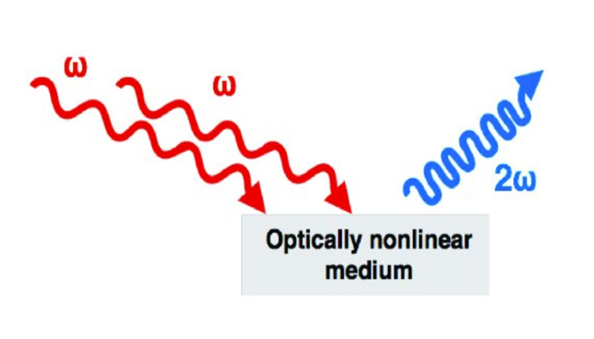
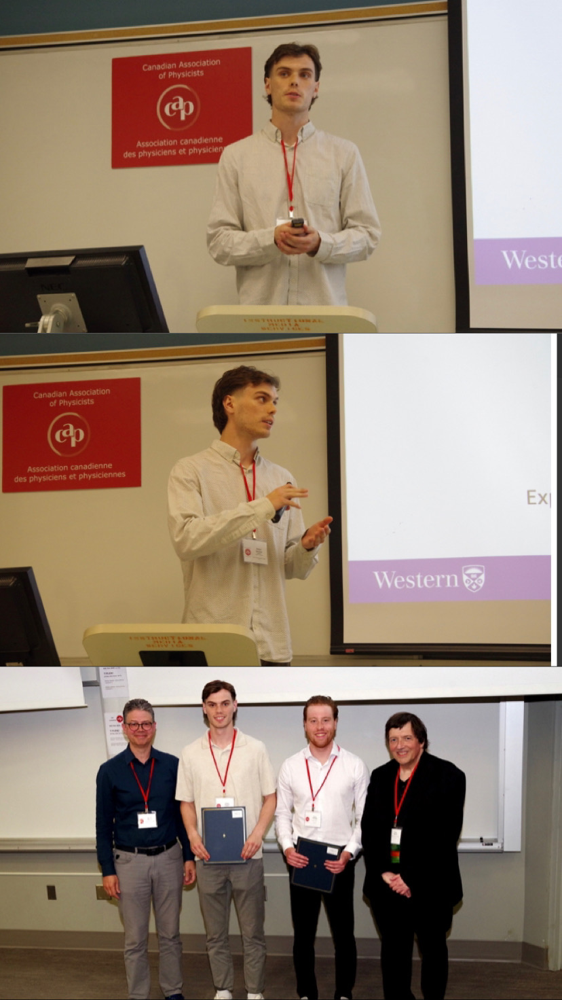

# Harmonic Generation with Metallic Nanohybrids

## Brief Description

<figure style="float:right; margin-right:10px; width:400px; text-align:center;">
    
    <figcaption style="font-size:small;">
        The basic process of second harmonic generation. 
        <a href="https://www.researchgate.net/publication/319134631_Imaging_Collagen_in_Scar_Tissue_Developments_in_Second_Harmonic_Generation_Microscopy_for_Biomedical_Applications/figures?lo=1" target="_blank">Source</a>.
    </figcaption>
</figure>

<figure style="float:right; margin-right:10px; width:450px; text-align:center; clear:both;">
    
    <figcaption style="font-size:small;">An illustration of phase matching, a requirement for efficient SHG, from my simulations.</figcaption>
</figure>

The invention of the laser led to the revolutionary discovery of *nonlinear optics*, characterized by a nonlinear relationship between the response of a material and its incident electric field. *High harmonic generation* is a nonlinear effect whereby a nonlinear medium such as a crystal or nanoparticle interacts with a monochromatic coherent incident wave and emits a frequency-multiplied coherent wave. For example, in second (third) harmonic generation, or SHG (THG), the frequency is doubled (tripled). This process is the source of numerous applications and phenomena of interest, from biological sensing and microscopy to Raman and Brillouin scattering. Recently, there has been a growing interest in the use of metallic nanohybrids, nanostructures made of multiple metallic species, as an avenue for exploring how signals of harmonic generation can be enhanced by plasmonic properties. In particular, these materials possess *localized surface plasmon resonances*, which allow for strongly enhanced local electric fields and thus enhanced high harmonic generation. 

This project aimed to develop a theory for **second and third harmonic generation in metallic nanohybrids** that are plasmonic multilayer films of gold, aluminum, and copper sulfied nanoparticles. The theory uses surface plasmon polaritons and the dipole-dipole interaction to explain enhancement of harmonic generation in these materials. 

## More Information

<figure style="float:right; margin-right:10px; width:400px; text-align:center;">
    
    <figcaption style="font-size:small;">CAP Congress, May 27/30 2024.</figcaption>
</figure>

I was involved with this project as an undergraduate honours thesis student with Prof. [Mahi Singh](https://physics.uwo.ca/~msingh/) at Western University. As part of the thesis program, I completed a final written thesis as well as a midterm and final presentation. I also presented numerous times to Dr. Singh's group seminars, and gave a [poster presentation](./media/thgposter.pdf). I gave an oral presentation at the Canadian Association of Physicists (CAP) Congress at Western University in 2024, winning [third prize](./media/capcert.pdf) in the atomic, molecular, and optical (AMO) physics division as an undergraduate competing nationally against graduate students. The slides for that presentation can be found [here](./media/capslides.pdf).

We collaborated with an experimental group at Vanderbilt University for this project. Additionally, a graduate student in Dr. Singh's group joined the project after I finished my thesis to assist in the theory's addition of *sum frequency generation* to explain the results. We have submitted a paper on the project for peer revision; I will link it here when it is published. Myself and Dr. Singh's graduate student were responsible for the numerical simulations and experimental fitting, while Dr. Singh was most responsible for the analytical work.  
